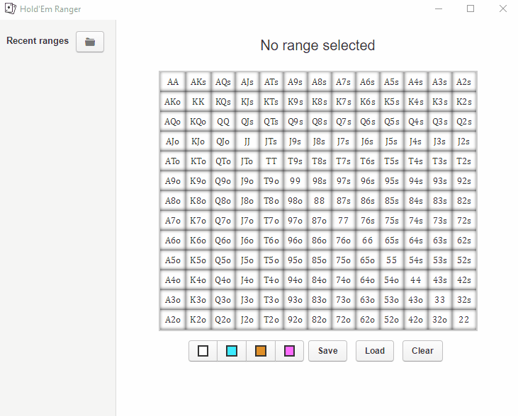

# Welcome to Hold'em Ranger

Ranger is a new, simple and portable way to store your Texas Hold'Em ranges.

## What it offers

Ranger offers the following features:

- Create, store and load your ranges.
- Up to 4 different colors.
- A portable file format (`.rng`), to be able to **share** your ranges.
- The possibility to load all ranges in a folder, to easily switch between them in game.

Here's a demonstration:

## What it does not (and doesn't intend to)

- No equity calculations (we have (Equilab)[https://www.pokerstrategy.com/poker-software-tools/equilab-holdem/] for that)
- No tracking.

# For the Geeks

Ranges is built in NodeJS with Electron. It stores ranges in pure JSON so that they can even be crafter from outside it.

## Contribution

Hold'em Ranger is published under the GPLv3 license, and welcomes all contributions. Currently the focus is on improving the UI and adding functionality such as custom colors. If you want to contribute and would like some pointers don't hesitate to contact me at `blorente.me (at) gmail.com`.
